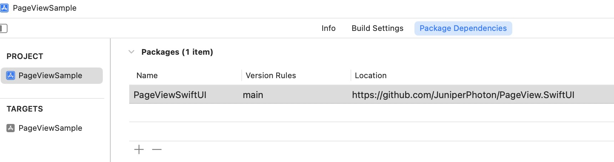

# PageView.SwiftUI


A container view that provides paging  with virtualization/lazy loading feature, being implemented purely in `SwiftUI` using `HStack` and `DragGesture` internally. 

> Since it's SwiftUI native view, it supports iOS, iPadOS and macOS.

PageView takes care of the views displaying in the screen, and will discard the views offscreen(which is defined by ``offscreenCountPerSide``).

Users can swipe horizontally to switch pages. You provides ``pageIndex`` binding to get or set the current page.

To get more paging info like paging progress, you pass the ``onPageTranslationChanged`` block and you will get noticed when paging translation changed.

> NOTE: If you just need a container view as a navigating root view with swiping to switch pages, you can just use the official ``TabView`` with .page `TabViewStyle`. However, if you want to display a large amount of data, this ``PageView`` is for you since it has virtualization/lazy loading feature.

## Import using Swift Package



Add as package dependencies in your Xcode, like below.

```
https://github.com/JuniperPhoton/PageView.SwiftUI
```

Before using PageView, remember to import: 

```swift
import PageView
```

## Example

The first look:

```swift
PageView(items: items,
         pageIndex: $pageIndex,
         disablePaging: Binding.constant(false), spacing: 8) { item in
    ZStack {
        AsyncImage(...)
        
        Text(...)
    }
}
```

The example above achieve the following feature:


The indicator uses the binding `pageIndex` to update itself:

```swift
HStack {
    ForEach(items, id: \.id) { item in
        Circle().fill(Color.white)
            .opacity(items.firstIndex(of: item) == pageIndex ? 1.0 : 0.5)
            .frame(width: 12, height: 12)
    }
}.frame(maxWidth: .infinity, maxHeight: .infinity, alignment: .bottom)
    .padding()
```

## Customization 

First please refer to the initializer of the ``PageView``.

- Parameter `items`: items to be populated, should be a ``RandomAccessCollection``
- Parameter `pageIndex`: a binding to the current page index
- Parameter `disablePaging`: a binding to disable the paging. Set this to true will disable the gesture, you can still set the ``pageIndex`` to navigate to the specified page
- Parameter `offscreenCountPerSide`: effects how many Views will be on screen at the same time. The default value is 2, which makes ``1 + 2 * 2 = 5`` views. Your ``items`` could be as large as you want, and keep this ``offscreenCountPerSide`` small to help reduce your memory footage.
- Parameter `spacing`: spacing between pages, horizontally. Note that the spacing won't be see until users start swiping
- Parameter `scrollSlop`: how much pts the user swipe to navigate to the next page, default to 20pt
- Parameter `animationDuration`: animation duration, default to 0.3 seconds
- Parameter `onPageTranslationChanged`: when the user start swiping, this block will be invoked to provide information about paging translation. See ``PagingTranslation`` to know more.
- Parameter `itemContent`: provides ``View`` given a ``C.Element`` you passed in the ``items``

```swift
    public init(items: C,
                pageIndex: Binding<Int>,
                disablePaging: Binding<Bool>,
                offscreenCountPerSide: Int = 2,
                spacing: CGFloat = 20,
                scrollSlop: CGFloat = 20,
                animationDuration: CGFloat = 0.3,
                onPageTranslationChanged: ((PagingTranslation) -> Void)? = nil,
                @ViewBuilder itemContent: @escaping (C.Element) -> Content)
```

The example of `onPageTranslationChanged` will output when swiping from `page0` to `page1`. You can use this progress to update your indicator progressively.

```
app current translation is 0 -> 1, Progress: 0.028837985361502068
app current translation is 0 -> 1, Progress: 0.03816793893129771
app current translation is 0 -> 1, Progress: 0.05173874872028069
app current translation is 0 -> 1, Progress: 0.05597964376590331
app current translation is 0 -> 1, Progress: 0.057675970723004136
app current translation is 0 -> 1, Progress: 0.05937233650654024
app current translation is 0 -> 1, Progress: 0.06446139503071327
app current translation is 0 -> 1, Progress: 0.07803220481969625
app current translation is 0 -> 1, Progress: 0.09499574617575143
app current translation is 0 -> 1, Progress: 0.11535198027244355
app current translation is 0 -> 1, Progress: 0.14079727289330868
app current translation is 0 -> 1, Progress: 0.15521628498727735
app current translation is 0 -> 1, Progress: 0.1798133753031568
app current translation is 0 -> 1, Progress: 0.20610687022900764
app current translation is 0 -> 1, Progress: 0.24173027989821882
app current translation is 0 -> 1, Progress: 1.0
```

## Example

This repo includes a example app, navigate to [this](https://github.com/JuniperPhoton/PageView.SwiftUI/tree/main/PageViewSample) to know more.

## Limitations

There are some limitations which are about to be resolved(perhaps we don't have enough API to do this):
- Inside the ``PageView``, you can put a SwiftUI ``List`` and it works fine. But if you put a ``ScrollView`` with grids or stacks, ``PageView`` would take over the gesture and the ``ScrollView`` can't be scrolled. Currently SwiftUI can't handle the conflict of your custom gesture with other built-in views'.
